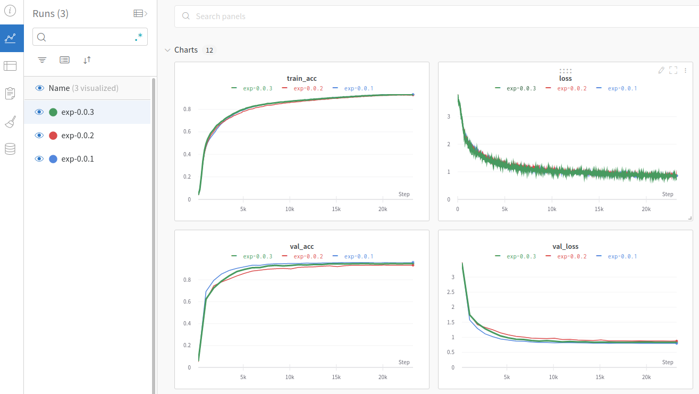

(All of the followings are the explanations and results of Torch-KWT)

# Torch-KWT
Unofficial PyTorch implementation of [*Keyword Transformer: A Self-Attention Model for Keyword Spotting*](https://arxiv.org/abs/2104.00769).

<a href="https://colab.research.google.com/github/ID56/Torch-KWT/blob/main/notebooks/Torch_KWT_Tutorial.ipynb" target="_parent"></a>


## Setup

```
pip install -r requirements.txt
```

## Dataset
To download the Google Speech Commands V2 dataset, you may run the provided bash script as below. This would download and extract the dataset to the "destination path" provided.

```
sh ./download_gspeech_v2.sh <destination_path>
```

## Training

The Speech Commands V2 dataset provides a "validation_list.txt" file and a "testing_list.txt" file. Run:

```
python make_data_list.py -v <path/to/validation_list.txt> -t <path/to/testing_list.txt> -d <path/to/dataset/root> -o <output dir>
```

This will create the files `training_list.txt`, `validation_list.txt`, `testing_list.txt` and `label_map.json` at the specified output dir. 

Running `train.py` is fairly straightforward. Only a path to a config file is required. Inside the config file, you'll need to add the paths to the .txt files and the label_map.json file created above.

```
python train.py --conf path/to/config.yaml
```

Refer to the [example config](sample_configs/base_config.yaml) to see how the config file looks like, and see the [config explanation](docs/config_file_explained.md) for a complete rundown of the various config parameters.

## Inference

You can use the pre-trained model (or a model you trained) for inference, using the two scripts:

- `inference.py`: For short ~1s clips, like the audios in the Speech Commands dataset
- `window_inference.py`: For running inference on longer audio clips, where multiple keywords may be present. Runs inference on the audio in a sliding window manner.

```
python inference.py --conf sample_configs/base_config.yaml \
                    --ckpt <path to pretrained_model.ckpt> \
                    --inp <path to audio.wav / path to audio folder> \
                    --out <output directory> \
                    --lmap label_map.json \
                    --device cpu \
                    --batch_size 8   # should be possible to use much larger batches if necessary, like 128, 256, 512 etc.

!python window_inference.py --conf sample_configs/base_config.yaml \
                    --ckpt <path to pretrained_model.ckpt> \
                    --inp <path to audio.wav / path to audio folder> \
                    --out <output directory> \
                    --lmap label_map.json \
                    --device cpu \
                    --wlen 1 \
                    --stride 0.5 \
                    --thresh 0.85 \
                    --mode multi
```
For detailed usage example, check the colab tutorial.

## Tutorials
- [Colab Tutorial: [Using pretrained model | Inference scripts | Training]](https://colab.research.google.com/github/ID56/Torch-KWT/blob/main/notebooks/Torch_KWT_Tutorial.ipynb)

## Weights & Biases

You can optionally log your training runs with [wandb](https://wandb.ai/site). You may provide a path to a file containing your API key, or simply provide it manually from the login prompt when your start your training.



## Pretrained Checkpoints

| Model Name | Test Accuracy | Link |
| ---------- | ------------- | ---- |
|    KWT-1   |     95.98*     | [kwt1-v01.pth](https://drive.google.com/uc?id=1y91PsZrnBXlmVmcDi26lDnpl4PoC5tXi&export=download) |

*The [example config file](sample_configs/base_config.yaml) provided contains the exact settings used to train the KWT-1 checkpoint, and should be reproducible.

"Requires adaptive accuracy report."
